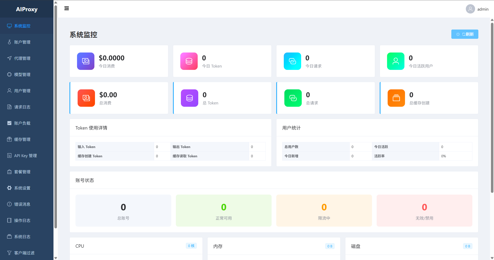
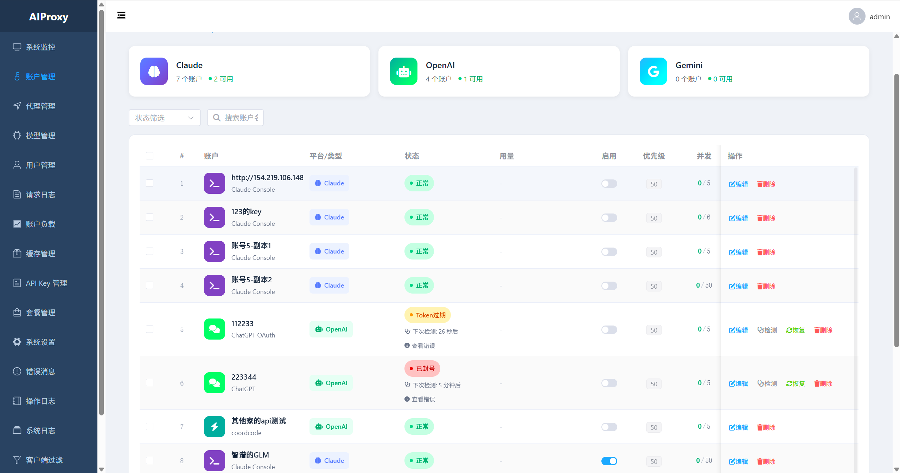
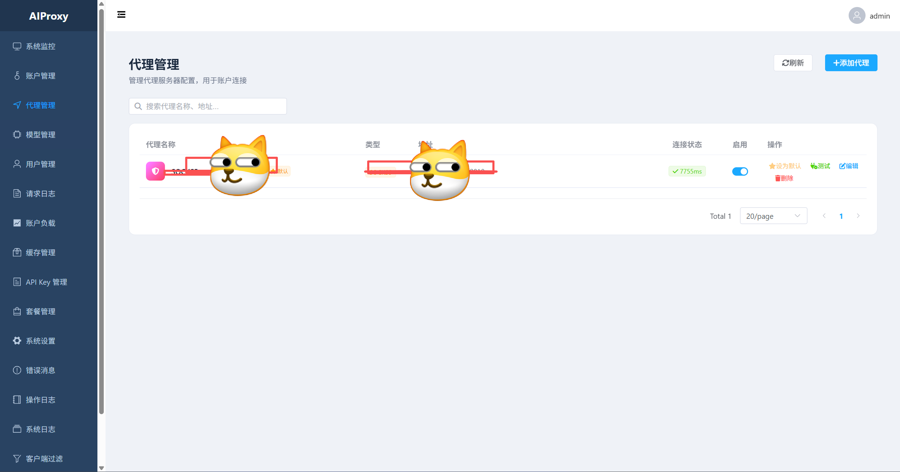
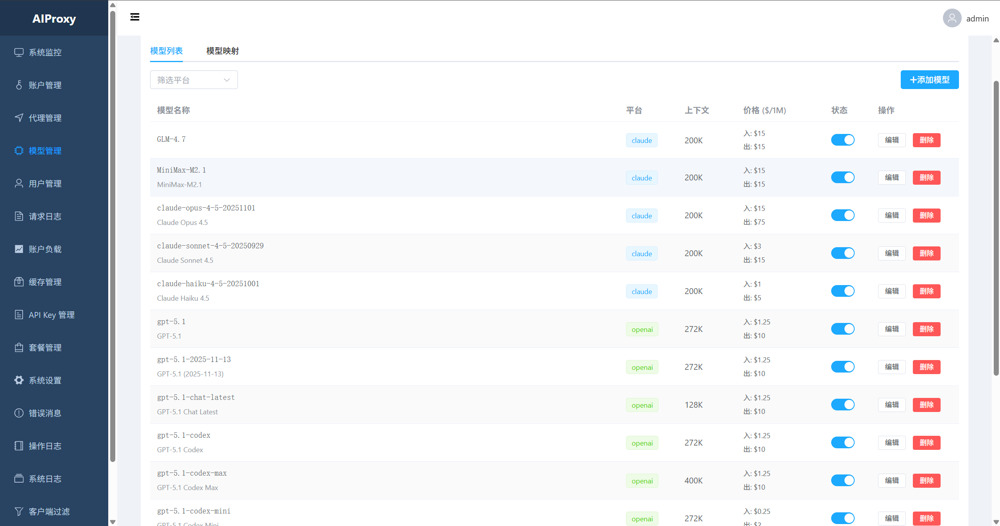
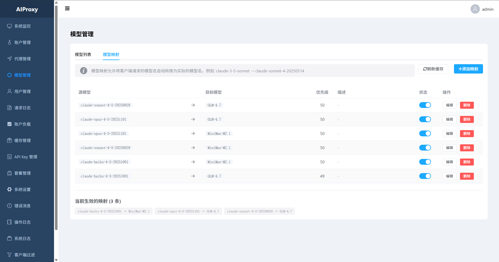
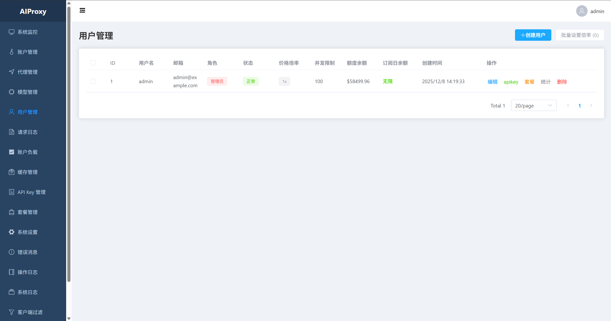
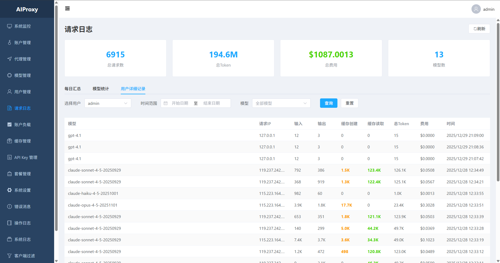
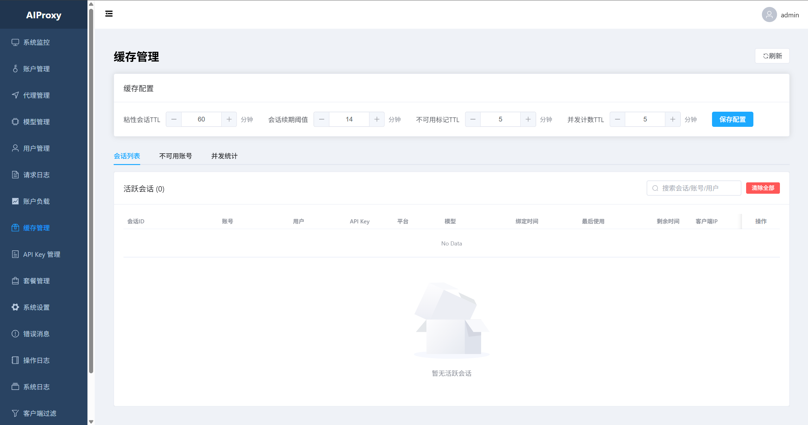

<div align="center">

  

  # 叶渡AI Hub

  ### 🚀 企业级 AI API 代理服务

  [](https://opensource.org/licenses/MIT)
  [](https://golang.org/)
  [](https://vuejs.org/)
  [](https://github.com/suiyuebaobao/go-proxy-pro/stargazers)
  [](https://github.com/suiyuebaobao/go-proxy-pro/network/members)

  **多平台 AI API 统一网关** - 支持 Claude、OpenAI、Gemini 等

  [功能特性](#-功能特性) • [快速开始](#-快速开始) • [系统截图](#-系统截图) • [文档](#-文档) • [贡献](#-贡献指南)

  **简体中文** | [**English**](README.md)

</div>

---

## ✨ 功能特性

### 🎯 多平台支持
- **Claude**: Official、Console、CCR、Bedrock
- **OpenAI**: API、Azure、Responses API
- **Gemini**: OAuth 和 API Key 模式

### 🔧 强大功能
- **账户池管理**: 负载均衡、故障转移、轮询调度
- **用户 API Key**: 用户可生成专属 API Key
- **权限控制**: 平台和模型级别的访问权限控制
- **使用统计**: 请求次数、Token 消耗、费用统计
- **OpenAI Responses API**: 支持 Codex CLI 和 Claude Code
- **健康监控**: 自动账户健康检查和恢复

### 🛡️ 企业级特性
- JWT 认证管理后台
- API Key 认证代理 API
- 请求日志和审计追踪
- 限流和并发控制
- Nginx HTTPS/SSL 支持

---

## 🎸 系统截图

### 登录页面


### 系统监控


### 账户管理


### 模型管理


### 用户管理


### API Key 管理


### 请求日志


### 使用统计


👉 [查看更多截图](screenshots/)

---

## 🚀 快速开始

### 环境要求

- **Go** 1.21+
- **MySQL** 8.0+
- **Node.js** 18+（前端开发）

### 方式一：Docker 部署（推荐）

```bash
# 克隆仓库
git clone https://github.com/suiyuebaobao/go-proxy-pro.git
cd go-proxy-pro

# 启动服务（MySQL + 应用）
docker-compose up -d

# 查看日志
docker-compose logs -f

# 停止服务
docker-compose down
```

**访问地址**:
- 🌐 Web 管理界面: http://localhost:8080
- 📊 API 接口: http://localhost:8080/claude/v1/messages
- 🗄️ MySQL 数据库: localhost:3306

**默认管理员账号**:
- 用户名: `admin`
- 密码: `admin123`

⚠️ **首次登录后请及时修改密码！**

### 方式二：源码编译

```bash
# 编译后端
go build -o fuye ./cmd/server

# 运行
./fuye
```

服务默认监听 `8080` 端口。

---

## 📚 API 使用指南

### Base URL 配置

| 平台 | Base URL | 完整端点示例 |
|------|----------|--------------|
| Claude | `http://域名/claude/` | `/claude/v1/messages` |
| OpenAI | `http://域名/openai/` | `/openai/v1/chat/completions` |
| Gemini | `http://域名/gemini/` | `/gemini/v1/chat` |

### 示例：Claude API

```bash
curl http://localhost:8080/claude/v1/messages \
  -H "x-api-key: YOUR_API_KEY" \
  -H "Content-Type: application/json" \
  -d '{
    "model": "claude-sonnet-4-20250514",
    "messages": [{"role": "user", "content": "你好！"}],
    "max_tokens": 1024
  }'
```

### 示例：OpenAI API

```bash
curl http://localhost:8080/openai/v1/chat/completions \
  -H "x-api-key: YOUR_API_KEY" \
  -H "Content-Type: application/json" \
  -d '{
    "model": "gpt-4",
    "messages": [{"role": "user", "content": "你好！"}]
  }'
```

### 示例：OpenAI Responses API (Codex CLI)

```bash
curl http://localhost:8080/responses \
  -H "x-api-key: YOUR_API_KEY" \
  -H "Content-Type: application/json" \
  -d '{
    "model": "gpt-5.1-codex-max",
    "input": "写一个 Hello World 函数"
  }'
```

---

## 📁 项目结构

```
fuye/
├── cmd/server/          # 程序入口
├── internal/
│   ├── handler/         # HTTP 处理器
│   ├── middleware/      # 中间件（JWT、API Key 认证等）
│   ├── model/           # 数据模型
│   ├── repository/      # 数据访问层
│   ├── service/         # 业务逻辑
│   └── proxy/           # 代理核心
│       ├── adapter/     # 平台适配器
│       └── scheduler/   # 账户调度器
├── pkg/                 # 公共工具
└── web/                 # Vue 3 前端
```

---

## 🛠️ 技术栈

### 后端
- **Go** 1.21+ + **Gin** 框架
- **MySQL** 8.0+ + **GORM**
- 内存缓存（sync.Map）
- JWT + API Key 双重认证

### 前端
- **Vue** 3.4+（Composition API）
- **Vite** 5.x
- **Element Plus** 2.6+
- **Alova** 3.x（HTTP 客户端）
- **Font Awesome** 6.x

---

## 🔧 配置说明

### 环境变量

| 变量名 | 默认值 | 说明 |
|--------|--------|------|
| `PORT` | `8080` | 服务端口 |
| `DB_HOST` | `localhost` | MySQL 主机 |
| `DB_PORT` | `3306` | MySQL 端口 |
| `DB_USER` | `root` | MySQL 用户名 |
| `DB_PASSWORD` | - | MySQL 密码 |
| `DB_NAME` | `fuye` | 数据库名 |

### Docker Compose 变量

| 变量名 | 默认值 | 说明 |
|--------|--------|------|
| `MYSQL_ROOT_PASSWORD` | `fuye-root` | MySQL root 密码 |
| `MYSQL_DATABASE` | `fuye` | 数据库名 |
| `MYSQL_USER` | `fuye` | MySQL 用户名 |
| `MYSQL_PASSWORD` | `fuye-password` | MySQL 密码 |
| `JWT_SECRET` | `change-in-production` | JWT 密钥 |

⚠️ **生产环境请修改所有默认密码！**

---

## 📖 文档

- [开发指南](docs/README.md) - 开发环境配置和规范
- [API 文档](docs/接口文档/) - API 接口参考
- [架构设计](docs/架构设计/) - 系统架构说明
- [故障排查](docs/故障排查手册.md) - 常见问题和解决方案

---

## 🤝 贡献指南

欢迎贡献代码！请随时提交 Pull Request。

1. Fork 本仓库
2. 创建特性分支 (`git checkout -b feature/AmazingFeature`)
3. 提交更改 (`git commit -m 'Add some AmazingFeature'`)
4. 推送到分支 (`git push origin feature/AmazingFeature`)
5. 开启 Pull Request

---

## 📞 联系方式

- **作者微信**: suiyue_creation
- **QQ 交流群**: [点击加入群聊【go-proxy-pro】](https://qm.qq.com/q/iJ4bHLlMEa)
- **GitHub Issues**: [提交问题](https://github.com/suiyuebaobao/go-proxy-pro/issues)
- **GitHub Discussions**: [参与讨论](https://github.com/suiyuebaobao/go-proxy-pro/discussions)

---

## 📄 开源协议

本项目采用 MIT 协议开源 - 详见 [LICENSE](LICENSE) 文件

---

## ⭐ Star 历史

如果你觉得这个项目有帮助，请给它一个 Star！⭐

<div align="center">

  **由 suiyueobao 用 ❤️ 打造**

  **本项目 95% 使用 GLM 配合 Claude Code 开发完成**

  [⬆ 返回顶部](#叶渡ai-hub)

</div>
